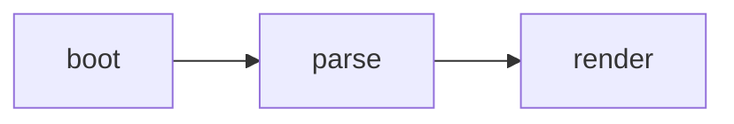
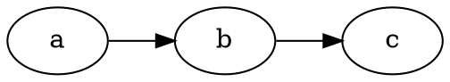

# Markdown rendering

## Overview

How a notebook note becomes the rendered page. Everything in this document
describes the client-side pipeline; the server stores note bodies as plain
text and never renders Markdown itself. Siblings: [frontend.md](frontend.md)
for the module inventory and boot sequence,
[hybrid-editing.md](hybrid-editing.md) for the WYSIWYG write-back contract.

The viewer renders with marked v12.0.2 in GFM mode and `breaks` off
(`viewer.js:266`):

```js
marked.parse(src, { gfm: true, breaks: false });
```

After marked returns HTML it is assigned to `#viewer-content.innerHTML`,
then the post-processing runs in order:

1. Every `h1`–`h6` gets a stable, deduplicated `id` (the pass starts at
   `viewer.js:273`; `slugify` is defined at `viewer.js:45`). The outline
   tracks those ids, and `?file=…&heading=…` deep links scroll to them
   (`NB.app.parseDeepLink` at `app.js:550`, `NB.viewer.scrollToHeading`
   at `viewer.js:819`).
2. highlight.js highlights every `pre code` (`viewer.js:278`).
3. `NB.blocks.renderAll()` runs the five special block renderers (call at
   `viewer.js:297-299`, registry at `static/js/blocks.js`).

Markdown is rendered **un-sanitized**. The notes are the user's own files,
so there is no third-party content in the render path
(`viewer.js:5-7`). If untrusted content is ever introduced, a vendored
DOMPurify pass is required before `innerHTML`.

Because `breaks` is off, a single newline does not start a new paragraph.
There is no emoji shortcode plugin, so `:smile:` stays literal text.

## Supported syntax

marked's GFM mode covers standard Markdown plus:

- Tables (with the preview-only table view in `static/js/table-view.js` and
  rectangular cell copy in `static/js/table-select.js`).
- Task lists (`- [ ]` / `- [x]`); Turndown emits them back as task items.
- Fenced and indented code blocks.
- Autolinks and raw HTML.
- Strikethrough.

Atx headings (`#` through `######`) become the outline and get anchor ids.
Setext headings (`===` / `---` underlines) also render, but the outline is
built from `<h1>`–`<h6>` elements, so they are anchored the same way.

## Special fenced blocks

Five fence languages render specially rather than as highlighted source.
Each is a fixed vendored version, so only syntax that version supports
works. The renderers are modules that register a descriptor with
`NB.blocks` (`register()` at `static/js/blocks.js:63`). Registration order
is render order.

### `mermaid` — Mermaid 11.16

Flowcharts, sequence diagrams, class diagrams, state diagrams, ER diagrams,
gantt charts, and the other Mermaid diagram types.

````markdown

````

Mermaid is initialized with `securityLevel: "strict"` and
`startOnLoad: false` (`mermaid.js:110`, the option at `mermaid.js:113`).
Strict mode disables interactive click and link directives, so a click on
a diagram node cannot navigate. Click a rendered SVG to open the
full-size lightbox (`mermaid.js:289`). A syntax error replaces the block
with an in-place `.mermaid-error` box and raises a toast
(`mermaid.js:193`). Rendering is asynchronous; the original fence stays in
the note, and the rendered container keeps the source in a dataset for the
hybrid round-trip (`mermaid.js:148`). The ~3.5 MB bundle is fetched on
demand, only when a note contains a mermaid block (`mermaid.js:74`).

### `wavedrom` — WaveDrom 3.3

Digital timing and waveform diagrams. The body is WaveDrom JSON.

````markdown
```wavedrom
{signal: [
  {name: 'clk', wave: 'p.....'},
  {name: 'dat', wave: 'x.345x', data: ['head', 'body', 'tail']}
]}
```
````

The parser tries strict `JSON.parse` first and falls back to a lenient
`eval` so unquoted (JS-style) keys are accepted, matching the official
WaveDrom editor (`parseSource` at `wavedrom.js:240`, the eval at
`wavedrom.js:251`). Malformed blocks fall back to an inline
`.wavedrom-error` box plus a toast (`wavedrom.js:187`). Click a rendered
waveform to open the lightbox (`wavedrom.js:265`).

### `math` / `katex` — KaTeX 0.16

Display-mode LaTeX. `math` and `katex` are aliases; the hybrid round-trip
always writes the fence back as `math` (the descriptor's `fence: "math"`
at `katex.js:144`).

````markdown
```math
\int_0^\infty e^{-x^2}\,dx = \frac{\sqrt{\pi}}{2}
```
````

Only KaTeX-supported LaTeX commands work. There are no full TeX macros.
`displayMode: true` and `throwOnError: false` (`katex.js:88-89`); a bad
expression renders the raw source in place rather than throwing.

### `dot` / `graphviz` — Graphviz 2.40.1

Graphviz diagrams, rendered by Viz.js 2.1.2 compiled to WASM. The two
vendor bundles are `viz.js` and `viz.full.js`. Both fences are aliases;
the round-trip writes `dot` (the descriptor's `fence: "dot"` at
`viz.js:203`).

````markdown

````

This is an old Graphviz. Avoid syntax newer than 2.40. The ~2 MB WASM
bundles load on demand (`viz.js:33`). Click a rendered graph to open the
lightbox.

### `html-live`

A sandboxed iframe that runs the markup. Plain `html` (without `-live`)
still shows highlighted source (`htmlpreview.js:5`).

````markdown
```html-live
<!-- height: 480 -->
<button onclick="this.textContent='clicked'">Click me</button>
```
````

An optional comment line `<!-- height: 480 -->` sets a minimum height
(`parseHeight` at `htmlpreview.js:54`). The parser scans the whole block,
so the hint may sit anywhere. The frame still grows to fit taller
content; the hint is a floor, not a fixed size. It accepts `height: N` or
`height=N`, optionally prefixed by `//`, `<!--`, or `#`.

## `html-live` sandbox

The iframe is built with `sandbox="allow-scripts"` and deliberately
**without** `allow-same-origin` (`buildFrame` at `htmlpreview.js:207`,
the `setAttribute` at `htmlpreview.js:210`). Scripts run, but the document
gets an opaque origin. The following are blocked:

- Cookies.
- `localStorage` and `sessionStorage` (an opaque origin throws).
- The parent page's DOM.
- The notebook API (`/api/*`).
- Same-origin `fetch`.
- Form submission.
- `window.open` and popups.
- File downloads.
- `alert`, `confirm`, and `prompt`.
- Top-level navigation.

External `fetch` is subject to CORS. Use `html-live` only for
self-contained, offline demos. This list must stay in sync with the
assistant's system prompt (`static/js/ai.js:768`) and the `/agent.md`
guide (`agent.md:154`); `TestAgentGuide.test_serves_markdown_with_key_sections`
(`tests/test_app.py:2191`) asserts the restrictions appear on `/agent.md`.

## Wikilinks

Obsidian-style `[[Target]]` links are tokenized by a marked inline
extension registered once at module load (`registerWikilinkExtension` at
`static/js/viewer.js:75`). Resolution rules — the resolver is
`resolveWikilink` at `viewer.js:120`, with the rules documented at
`viewer.js:59-69`:

- A bare stem resolves by basename. `[[README]]` and `[[README.md]]` both
  link to `README.md`, even from a subfolder.
- A path is relative to the current note's folder. `.` and `..` segments
  are normalized.
- `[[Target#anchor]]` deep-links to the heading with that slug.
- `[[Target|label]]` sets the link text.

An unresolvable target renders as plain text, never a dead link (the gate
at `viewer.js:98`, the raw-span emit at `viewer.js:104`). Clicking a
resolved wikilink opens the target in place through the SPA; there is no
page reload, and the back button restores the source note and scroll
position (the click handler at `viewer.js:989`, the `pushNav` branch at
`viewer.js:1000-1009`).

## Hybrid editing and the write-back contract

Hybrid (WYSIWYG) mode edits the rendered DOM in place. On save it converts
the DOM back to Markdown with Turndown plus the GFM plugin
(`ensureTurndown` at `static/js/hybrid.js:170`, the options at
`hybrid.js:173-180`). A wikilink added to the DOM round-trips through a
custom Turndown rule so it is written back as `[[Target]]`
(`hybrid.js:188-195`; the unresolved form at `hybrid.js:201-205`).

Turndown strips unknown markup to text. That would destroy rendered
diagrams, so `NB.blocks.restoreForMarkdown()` runs first on a cloned DOM
(from `prepareTurndownClone`, `hybrid.js:477-478`). It replaces every
rendered container and error box with a fenced block holding the original
source, using each descriptor's `fence` language
(`blocks.js:144`). This is the data-loss-critical step: it is why a new
renderer must register with `NB.blocks` and expose its source, either as
a dataset key on the container or as a `.sourceClass` child inside the
error box.

The registry also owns the hybrid click-to-edit type table
(`blocks.js:182`), so a registered renderer is automatically
click-to-editable and round-trippable.

The full construct-by-construct contract — every syntax construct at
every caret position, the invariants, and the open questions — is
[hybrid-editing.md](hybrid-editing.md). Three rules from it matter here:

- A save that changes nothing writes nothing. Entering hybrid mode and
  saving without typing issues no `POST /api/file` at all: the saved form
  of the entered DOM is captured at `enter()` and compared before every
  write, in `save`, `onClose`, `onSaveExit`, `commitForTabSwitch`,
  `flushAutosave`, and `exit(true)` (`isNoOpMarkdown`, `hybrid.js:3426`).
  This matters because a whole-DOM serialization canonicalizes some
  constructs (a trailing blank line, a `*` bullet to `-`); regenerating
  them on an untouched note would silently rewrite the file.
- Two constructs cannot survive a plain Turndown pass and are carried
  through on a clone instead, then restored: an **empty heading**
  (`###` with no text) keeps its marker; an **empty list item** (`-` or
  `1.` with nothing after it) keeps its marker. A **whitespace-only
  inline code run** (`` ### `   ` ``) is preserved by swapping each space
  for a NUL-prefixed sentinel before Turndown runs (its
  `collapseWhitespace` deletes whitespace-only text nodes before any
  rule) and restoring it after. A NUL-prefixed token is used rather than a
  private-use character because private-use characters occur in real
  notes.
- Tables are always emitted as GFM, never as raw `<table>`:
  `normalizeTablesForGfm` (`hybrid.js:368-403`) rebuilds every table in
  the clone into the exact shape Turndown's GFM rule accepts (an
  all-`<th>` first row inside a leading `<thead>`), keeping inline markup
  intact, folding a `<caption>` into a paragraph, dropping `<colgroup>`,
  and removing a row-less table. Without it, a raw `<table>` from the
  source whose first row is not a heading row is kept verbatim as HTML.

## Adding or changing a renderer

A renderer module registers a descriptor with `NB.blocks.register()` at
load (`blocks.js:63`). The descriptor names the module, the claimed fence
languages, the round-trip fence, the selector, the container class, and
the dataset key or source class.

Adding or changing a renderer touches four places that a test keeps in
sync:

1. The module file itself, loaded by `templates/index.html`.
2. `static/sw.js` `PRECACHE`, so the service worker caches it.
3. The assistant's system prompt in `static/js/ai.js`
   (`static/js/ai.js:768`).
4. The `/agent.md` guide (`agent.md:148`).

The registry-completeness guard (`tests/dom/test_dom.js:3111-3130`)
asserts every registered module appears in all four.
`TestAgentGuide.test_serves_markdown_with_key_sections`
(`tests/test_app.py:2191`) asserts the fence languages, the fixed
versions, and the `html-live` restrictions appear on `/agent.md`.
Whenever a fence name, a vendored version, or a sandbox restriction
changes, update `ai.js` and `agent.md` in the same change or the suite
fails.