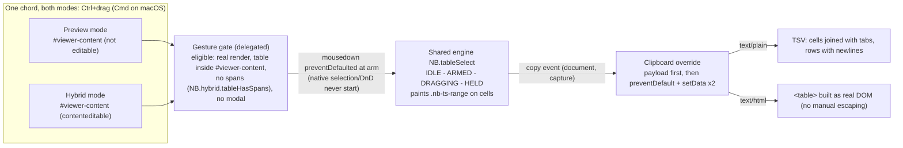
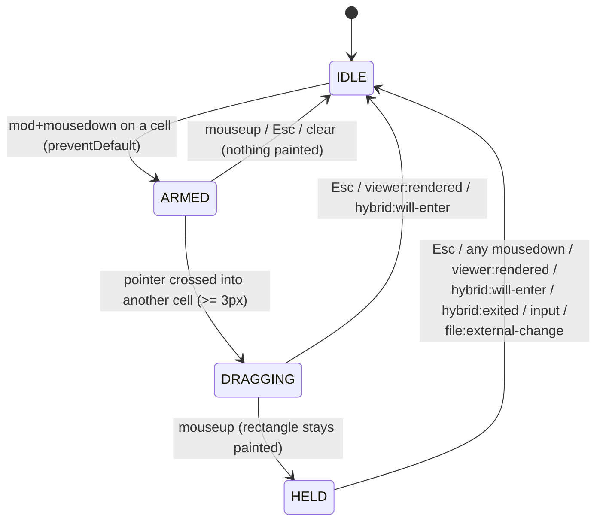

# Rectangular table cell selection — design blueprint

New module: `static/js/table-select.js` (`NB.tableSelect`). The user Ctrl+drags a
rectangle over cells of a rendered GFM table, then Ctrl+C copies it as a grid
(TSV + HTML `<table>`) that pastes into spreadsheets as a rectangle. Works in
preview mode and in hybrid edit mode through one shared engine. Firefox's
native table selection is the model.

No overlay, no persistence, no server changes, no changes to `table-view.js`
or `table-edit.js`. Three small strip/belt changes are added to `hybrid.js`
(section 8) and one cache bump to `sw.js`.

---

## 1. Interaction spec

### 1.1 The gesture: a platform modifier + drag, in BOTH modes

**Decision: a modifier is required; plain-drag hijacking is rejected.**

- In contenteditable, a plain drag over cells is *also* the native text
  selection gesture. No distance threshold can distinguish "text selection
  that crosses into the next cell" from "cell drag" — both are plain drags
  whose path crosses cell borders.
- The chord matches the platform's Firefox table-selection chord: **Ctrl on
  Windows/Linux, Cmd on macOS** (section 4.2). Ctrl+click on macOS is
  right-click, so Ctrl alone never arms there.
- No conflict exists in the app today: `shortcuts.js` binds Ctrl+S / Ctrl+E /
  Ctrl+F / Ctrl+Comma; hybrid table ops are Alt+arrows; `table-edit.js` drags
  start only from grips. Nothing binds Ctrl+drag.
- Alt is rejected: Alt+drag is window-move on some Linux desktop environments,
  and Alt is already the hybrid table-op modifier family.

### 1.2 Gesture sequence

1. **Modifier+mousedown on a `td`/`th` of an eligible table** → engine ARMED
   and the event **`preventDefault`ed immediately**. Canceling mousedown's
   default means:
   - the native text-selection/caret gesture never starts (this is why
     `table-edit.js` `startCommon` preventDefaults its pointerdown,
     table-edit.js:441);
   - Gecko's own Ctrl+drag table-selection gesture never starts in Firefox
     preview — our engine replaces it;
   - no `<a>`/`` drag-and-drop can start (a canceled mousedown suppresses
     the drag, per the HTML spec's drag initiation rules) — the M1 belt in
     section 5 backs this up.
   Deliberate tradeoff: the press does not move the caret in hybrid mode. A
   modifier+press is a selection gesture, never the caret gesture — plain
   mousedown is untouched.
2. **Pointer crosses into a different cell of the same table** (and has moved
   ≥ `DRAG_THRESHOLD_PX` = 3 px, a jitter guard) → takeover: paint the
   rectangle (`.nb-ts-range` on every cell in bounds), `.nb-ts-drag` on the
   table for a crosshair cursor. **No `removeAllRanges()`, no
   `user-select: none`** — nothing native ever started, so there is nothing
   to fight. (The previous draft's "let mousedown through, then take over"
   was unsound: editable content ignores `user-select: none`, and
   `removeAllRanges()` does not cancel an in-progress mouse drag selection.)
3. **mouseup** → `.nb-ts-drag` removed; the painted rectangle stays (HELD
   state). The user can now Ctrl+C.
4. **Ctrl+C** → the `copy` override writes the grid (section 6).
5. Any clear trigger (section 5) returns to IDLE.

A modifier+drag that stays inside one cell never takes over and paints
nothing. `DRAG_THRESHOLD_PX` is only a jitter guard on top of the
cell-crossing rule, never the gesture gate.

### 1.3 What a modifier+press does NOT do (guards on the arm)

- **Link/image Ctrl+click does not navigate.** `preventDefault` on mousedown
  does not cancel the *click* default, so a Ctrl+click on a link would still
  open a background tab. Guard: a capture `click` listener swallows the
  click default when this press armed (state ARMED→released or any
  rectangle outcome) and the target resolves `a, img` inside the armed
  table. Plain clicks (no modifier) are untouched.
- **DnD never starts from a cell.** Belt beyond the mousedown cancel: a
  capture `dragstart` listener `preventDefault`s while ARMED or DRAGGING
  (covers any engine that still raises it).
- **Caret is not moved** by the press (see 1.2 tradeoff).

### 1.4 Escape hatches

- **Esc** cancels a mid-drag rectangle or clears a held one (capture,
  `preventDefault` only — never `stopPropagation`). **Guarded by
  `modalIsOpen()`** (section 4.7): with Settings/auth open, the handler
  returns untouched so the modal's own Esc still closes it.
- **Any mousedown anywhere** clears a held rectangle (a new gesture always
  supersedes — including the next arming press).
- **Merged-cell tables never arm** (section 9.1). **Live preview never arms**
  (section 9.2). **A modal open never arms** (the overlay covers the viewer,
  but the gate checks anyway for symmetry with Esc/copy).

### 1.5 Rectangle semantics

- Anchored on the start cell and the current cell; the rectangle is the
  inclusive bounds between them, **in DOM order** (which is the visible order
  after a `table-view.js` sort).
- Any `td`/`th` resolves — header cells can be part of the rectangle.
- The rectangle never leaves the start table: a cell in a different table
  does not extend it (the rectangle holds at the last valid cell).
- **What you see is what you copy**: cells hidden by `table-view.js`
  (`.nb-tv-hide-row` / `.nb-tv-hide-col`) are excluded from both the painted
  rectangle and the copy payload.

---

## 2. Blueprint





Why no overlay (unlike `table-view.js` / `table-edit.js`): grips and toolbars
are positioned boxes that drift on scroll, so those modules need an overlay
plus scroll-hiding. The selection is painted on cells and moves with the
content. **Scroll does not clear the rectangle** — a rectangle spanning
scrolled-away cells is still correct to copy.

---

## 3. Verified starting points (all file:line references checked)

| Fact | Where |
| --- | --- |
| `table-view.js` sessions + `canInteract`, teardown on `hybrid:will-enter`/`hybrid:entered`, rebuild on `viewer:rendered` | `static/js/table-view.js:844-849, 928-946, 953-992` |
| `table-view.js` injects a `.nb-tv-head-menu` chevron into every header cell (payload must strip it) | `static/js/table-view.js:82-84, 327-345` |
| `table-view.js` exports `lastRenderLive` getter (reused, not duplicated) | `static/js/table-view.js:1201` |
| `table-view.js` overlay is a child of `#viewer`; layer is `pointer-events: none` | `static/js/table-view.js:1126-1161`, `static/css/style.css:739-745` |
| `table-edit.js` `startCommon` preventDefaults pointerdown "never move the caret / start selection" — the precedent for arm-time preventDefault | `static/js/table-edit.js:440-448` |
| `hybrid.js` enter: emits `hybrid:will-enter`, sets `contenteditable`, emits `hybrid:entered` | `static/js/hybrid.js:3289, 3294, 3373` |
| `hybrid.js` exit: removes `contenteditable`, emits `hybrid:exited` | `static/js/hybrid.js:3412, 3452` |
| `hybrid.js` `pushSnapshot` stores raw live `innerHTML`; called from the debounce (3062), `resetHistory` at enter (3071→3354), undo/redo flush (3098, 3106), and `flushPendingSnapshot` (3862-3868) — invoked by `moveRow` (3891) and `moveCol` (3908) BEFORE their mutation, and by `onContentChange` (3000-3006) which structural keydown/click paths call directly with NO `input` event (`insertLineBelow` 2387, `removeRuleLine` 2251, `indentListItem` 1922, `moveRow` 3893) | `static/js/hybrid.js:3000-3006, 3047-3071, 3862-3868` |
| `hybrid.js` `restoreSnapshot` replaces `innerHTML` wholesale with no event | `static/js/hybrid.js:3074-3094` |
| `hybrid.js` external change re-renders via `renderMarkdown` (replaces `innerHTML`, emits nothing) | `static/js/hybrid.js:1159-1193, 4560-4582` |
| `watcher.js` emits `file:external-change` (the hook for the above) | `static/js/watcher.js:244` |
| `hybrid.js` turndown clone strips chrome classes — the `HR_SELECTED_CLASS` precedent | `static/js/hybrid.js:412-420` |
| `hybrid.js` change-hash class token-strip precedent (`HR_SELECTED_CLASS`) | `static/js/hybrid.js:730-741` |
| `hybrid.js` `tableHasSpans(table)` | `static/js/hybrid.js:3874-3876` (exported at 4607); `moveRow`/`moveCol`/`flushPendingSnapshot` exported at 4598-4612 |
| `viewer.js` emits `viewer:rendered` with `{path, live}` | `static/js/viewer.js:261, 269, 322` |
| `api.js` pub/sub `NB.evt` | `static/js/api.js:187-202` |
| `shortcuts.js` `isMac()` exists but is NOT exported; `modalIsOpen()` checks `.settings-overlay:not([hidden]), #auth-overlay:not([hidden])`; the keydown dispatcher yields to open modals | `static/js/shortcuts.js:73-80, 244-246, 305-309, 386-391` |
| `vimnav.js` duplicates the same `modalIsOpen()` locally | `static/js/vimnav.js:48-50, 150` |
| Export renders from the content cache, never the DOM (pinned by an existing test) | `tests/dom/test_dom.js:9747-9748` |
| CSS custom properties `--accent`, `--accent-soft`, `--fg`, `--bg`, `--border` (dark + light themes) | `static/css/style.css:4-12, 58-65` |
| index.html script order (table-edit 961, table-view 962, watcher 963; shortcuts near the end) | `templates/index.html:961-963` |
| sw.js PRECACHE (table-edit 49, table-view 50) and `CACHE = "notebook-v5"` | `static/sw.js:16, 49-51` |
| Test harness `evalIn` order; completeness-check pattern | `tests/dom/test_dom.js:1438-1439, 9822-9825` |

---

## 4. Module design — `static/js/table-select.js`

IIFE extending `window.NB`, loaded once, always active in both modes.

### 4.1 Constants

```js
const RANGE_CLASS = "nb-ts-range";  // on each selected td/th
const DRAG_CLASS  = "nb-ts-drag";   // on the <table> during the drag only
const DRAG_THRESHOLD_PX = 3;        // jitter guard before takeover
const ARM_SELECTOR = "a, img";      // click-default swallow targets (1.3)
```

(`nb-ts-active` from the previous draft is dropped: no consumer. The drag
class earns its place as the cursor hook — see section 7.)

### 4.2 Platform modifier

A local `isMac()` copy of `shortcuts.js:73-80` (not exported at 386-391, and
`shortcuts.js` loads after this module anyway, so a runtime dependency would
be load-order-fragile). The arm predicate:

```js
const mac = isMac();
function armModifier(e) { return mac ? (e.metaKey && !e.ctrlKey) : e.ctrlKey; }
```

macOS: Cmd+drag arms; Ctrl+click (right-click) never arms — `ctrlKey` alone
is excluded on Mac. Windows/Linux: Ctrl+drag arms, matching Firefox's own
table chord.

### 4.3 Internal state

```js
let state = "IDLE";           // IDLE | ARMED | DRAGGING | HELD
let tableEl = null;           // the rectangle's table
let anchorCell = null;        // arming cell
let focusCell = null;         // current pointer cell
let lastX = 0, lastY = 0;     // threshold reference
let armConsumed = false;      // this press armed (click-swallow flag, 1.3)
```

No `lastRenderLive` copy: the eligibility gate reads
`NB.tableView.lastRenderLive` (the getter at table-view.js:1201).
`table-view.js` loads first and its `viewer:rendered` listener is registered
before ours, so the value is current when we consult it. If `NB.tableView` is
missing (broken load), treat it as not-live — arming in that degraded state is
harmless because every other gate still applies.

### 4.4 Mode hookup — one listener serves both modes

The task allowed "only the gesture hookup should differ" per mode; with one
shared chord, **nothing differs**. One delegated `mousedown` listener on
`#viewer-content` plus document-level click/dragstart/mousemove/mouseup/
copy/keydown listeners, installed once at module build. The only
mode-sensitivity is event-driven teardown (section 5). A per-mode hookup layer
would be an abstraction with two identical implementations — cut.

Eligibility gate (`eligible(table)`, checked at mousedown):

- `table` is inside `#viewer-content`;
- NOT live preview: `!(NB.tableView && NB.tableView.lastRenderLive)`;
- NOT `NB.hybrid.tableHasSpans(table)` (section 9.1);
- `#viewer` not hidden; `modalIsOpen()` false (section 4.7).

There is **no** `NB.hybrid.isActive()` check: the rectangle is valid in both
preview and hybrid. `NB.hybrid` may be absent; guard every call.

### 4.5 Cell resolution

Cells come from `e.target.closest("td,th")`. The engine is **geometry-free**:
it never reads `getBoundingClientRect` or `elementFromPoint`. Cell identity
comes from event targets, the threshold from `clientX/Y` deltas. This is also
what makes the jsdom tests possible.

### 4.6 Painting and clearing

On each state change, recompute the visible-cell rectangle between
`anchorCell` and `focusCell` (rows in DOM order, columns by `cellIndex`,
skipping `.nb-tv-hide-row` rows and `.nb-tv-hide-col` cells) and toggle
`RANGE_CLASS` only on changed cells — the same churn discipline as
`onSelectionChange` in `hybrid.js:1879`.

**`clear()` is DOM-driven, not cache-driven**: it queries
`#viewer-content` for `.nb-ts-range` and `.nb-ts-drag` and strips them, then
resets state. The previous draft cleared only its cached `painted` set, so
classes that reached the DOM by another path (a restored snapshot, a
wholesale `innerHTML` replacement) would have been stuck. DOM-driven clearing
cannot miss.

### 4.7 Modal guard

A local `modalIsOpen()` copy — the same three-liner `shortcuts.js:244-246` and
`vimnav.js:48-50` already duplicate (same selector
`.settings-overlay:not([hidden]), #auth-overlay:not([hidden])`). Both Esc and
copy handlers return untouched when it is true. Two modules already carry
private copies; a third follows the established pattern and avoids a new
shared dependency for one selector. If a fourth consumer appears, hoist it
into `app.js`.

### 4.8 Public API

```js
NB.tableSelect = {
  /* Cancel a drag, strip every class from the live DOM, reset state.
   * Idempotent; DOM-driven (4.6). */
  clear(),

  /* True while a rectangle is painted (DRAGGING or HELD) and its anchor
   * is still connected inside #viewer-content (stale-state guard, 8.4). */
  isActive(),

  /* { table, r0, r1, c0, c1 } of the painted rectangle, or null.
   * Indices are positions among VISIBLE rows/columns. */
  getRectangle(),

  /* { tsv, html } for the active rectangle, or null. Test seam; the
   * copy handler is its only in-app caller. */
  getPayload(),

  /* viewer:rendered hook: any render (live or real) clears. */
  onRendered(ev),

  /* hybrid:will-enter / hybrid:entered hook: synchronous teardown. */
  tearDownForEdit(),

  /* Test seams (build() wires the real listeners to these). */
  _onMouseDown(e), _onMouseMove(e), _onMouseUp(e),
  _onCopy(e), _onKey(e), _onClick(e), _onDragStart(e),
};
```

---

## 5. Event contract

| # | Event | Target / phase | Condition | Action |
| --- | --- | --- | --- | --- |
| 1 | `mousedown` | `document`, capture | any, while HELD or DRAGGING | `clear()` — a new press always supersedes (runs before #2). |
| 2 | `mousedown` | `#viewer-content`, bubble | `armModifier(e)` + resolves a cell + `eligible(table)` | ARM: record `anchorCell`, `lastX/Y`, `armConsumed = true`; **`e.preventDefault()`** (native selection/DnD/caret never start; Gecko's own Ctrl+drag table selection never starts). |
| 3 | `mousemove` | `document`, bubble | ARMED, moved ≥ 3 px, resolves a cell in the SAME table, different cell | Takeover: paint rectangle, add `DRAG_CLASS` (cursor), state DRAGGING. |
| 4 | `mousemove` | `document`, bubble | DRAGGING, resolves a cell (same table) | Repaint at the new focus cell. A cell in another table or a non-cell target leaves the rectangle unchanged. |
| 5 | `mouseup` | `document`, bubble | DRAGGING | Remove `DRAG_CLASS`. Rectangle stays painted (HELD). |
| 6 | `mouseup` | `document`, bubble | ARMED, no takeover | Reset to IDLE. `armConsumed` stays true until the next mousedown — the follow-up click default is still swallowed (1.3). |
| 7 | `click` | `document`, capture | `armConsumed` + target resolves `a, img` inside the armed table | `e.preventDefault()` — Ctrl+click does not open a tab / trigger the image (1.3). Plain clicks never match (no arm). |
| 8 | `dragstart` | `document`, capture | ARMED or DRAGGING | `e.preventDefault()` + `stopPropagation()` — the DnD belt (1.3). |
| 9 | `keydown` `Escape` | `document`, capture | HELD or DRAGGING, **`modalIsOpen()` false** | `clear()` + `preventDefault` (no `stopPropagation`). With a modal open: return untouched — the modal's Esc wins (4.7). |
| 10 | `copy` | `document`, capture | `isActive()`, **`modalIsOpen()` false** | Compute the payload FIRST; only then `preventDefault` + `setData` × 2 (section 6). A modal is open, no `clipboardData`, or a null payload → return without `preventDefault`; the native copy proceeds. |
| 11 | `input` | `#viewer-content`, bubble | HELD or DRAGGING | `clear()` — typing invalidates the rectangle (UX rule; the undo-safety belt is 8.2). |
| 12 | `viewer:rendered` | `NB.evt` | any | `clear()`; the live flag is read live from `NB.tableView.lastRenderLive` at gate time (4.3). |
| 13 | `hybrid:will-enter`, `hybrid:entered` | `NB.evt` | any | `tearDownForEdit()` (clear; belt for 12). |
| 14 | `hybrid:exited` | `NB.evt` | any | `clear()`. |
| 15 | `file:external-change` | `NB.evt` | any | `clear()` — covers hybrid's `renderMarkdown` re-render on disk change (hybrid.js:1159, 4573), which replaces `innerHTML` without emitting `viewer:rendered`. |
| 16 | `window blur` | `window` | DRAGGING only | Finalize the drag at the last valid cell (as if mouseup). |

Notes:

- The modal guards (rows 9, 10) exist because a rectangle CAN outlive an
  open-modal trigger: Ctrl+Comma opens Settings with no mousedown, so nothing
  else clears the rectangle first. This mirrors the yield rule in
  `shortcuts.js:305-309`.
- `copy` with focus in a non-modal text box (the search input) is already
  safe: clicking the input is a mousedown, which cleared the rectangle (row
  1) — by the time Ctrl+C fires, `isActive()` is false and the handler
  declines.
- Scroll of `#viewer-content` is deliberately NOT a trigger (section 2).

---

## 6. Clipboard contract

### 6.1 The override

One permanent capture listener on `document` (row 10). It takes precedence
**only** when a rectangle is active and no modal is open. Otherwise the
handler returns without touching the event, so every other copy path —
hybrid's native contenteditable copy, the context-menu `doCopy`
(hybrid.js:2854-2865), the code-block Copy button, plain text copies anywhere,
and copies made inside an open modal — is untouched.

```js
function _onCopy(e) {
  if (!isActive()) return;              // includes the stale-state guard
  if (modalIsOpen()) return;           // the modal owns Ctrl+C
  const payload = getPayload();         // compute BEFORE preventDefault:
  if (!payload) return;                 // a failure leaves the native copy intact
  if (!e.clipboardData) return;         // no channel: decline, native copy proceeds
  e.preventDefault();
  e.clipboardData.setData("text/plain", payload.tsv);
  e.clipboardData.setData("text/html", payload.html);
}
```

### 6.2 Payload

- **text/plain (TSV):** rows joined with `\n`, cells joined with `\t` —
  exactly what a spreadsheet parses into a rectangle.
- **text/html:** a `<table><tr><td>…` built as a **real detached DOM tree**
  (cell text assigned via `textContent`), read back with `outerHTML`. DOM
  construction means no manual HTML escaping exists to get wrong. All cells
  are `<td>`; a mid-table rectangle has no header semantics. Both flavors
  carry the same extracted plain text — inline formatting (bold, links) is
  deliberately not preserved; TSV into a spreadsheet is the point (cut as
  YAGNI, add later if missed).
- Rows are emitted in DOM order (visible/sorted order). Ragged rows (pasted
  HTML only): a missing cell becomes an empty string / empty `<td>` — the
  grid stays rectangular.

### 6.3 Cell text extraction (chrome-stripped, `<br>`-aware)

`textContent` alone is wrong twice: header cells carry the injected
`.nb-tv-head-menu` chevron (table-view.js:82-84, 327-345), and `<br>` runs
collapse ("foo<br>bar" → "foobar"). Extraction:

```js
function cellText(cell) {
  const clone = cell.cloneNode(true);
  // Strip view chrome injected into cells (M3): only the header menu icon.
  clone.querySelectorAll(".nb-tv-head-menu").forEach((n) => n.remove());
  // <br> becomes a space (M5): a raw newline is impossible in a TSV cell.
  clone.querySelectorAll("br").forEach((br) => br.replaceWith(" "));
  // An image contributes its alt text, or nothing (M5).
  clone.querySelectorAll("img").forEach((img) => img.replaceWith(img.alt || ""));
  // Collapse whitespace runs to single spaces and trim (normText pattern,
  // table-view.js:123-125) — kills any residual tab/newline that would
  // corrupt the grid.
  return normText(clone.textContent);
}
```

### 6.4 `navigator.clipboard` fallback?

**No.** `clipboardData.setData` inside the `copy` event is synchronous, needs
no permission, and cannot lose the gesture. The one degraded condition
handled is `e.clipboardData` being absent (jsdom, exotic embeddings): the
handler declines without `preventDefault`, so the native copy still happens.

After a successful copy the rectangle stays painted (Firefox behavior): the
user can adjust or re-copy. No toast — silent success matches every other
copy path in the app.

---

## 7. Visual selection — CSS

Add one section to `static/css/style.css` after the table-view block (after
line 935):

```css
/* ------------------------------------------------------------------ */
/* Rectangular table cell selection (table-select.js)                  */
/* ------------------------------------------------------------------ */
/* Painted on cells, so it moves with the content: no overlay, no
 * scroll-hiding. Background + inset shadow only — no layout property is
 * touched, so painting can never reflow the table. Colors come from the
 * existing theme custom properties, so both themes render correctly. */
#viewer-content .nb-ts-range {
  background: var(--accent-soft);
  box-shadow: inset 0 0 0 1px var(--accent);
}
/* Cursor cue during the drag: the only job of this class. No user-select
 * here — the arm-time preventDefault already owns the gesture (1.2). */
#viewer-content table.nb-ts-drag {
  cursor: crosshair;
}
```

Class list:

| Class | On | Lifetime | Purpose |
| --- | --- | --- | --- |
| `nb-ts-range` | `td`/`th` | while painted | the visible rectangle |
| `nb-ts-drag` | `<table>` | during the drag only | crosshair cursor |

(`nb-ts-active` is dropped from the previous draft — it had no consumer.)

Bug classes prevented: layout shift during paint (background/box-shadow
only); theme breakage (existing custom properties only); a second selection
engine fighting the drag (impossible — the arm preventDefault means no
native gesture ever starts).

---

## 8. Serialization, undo, and export safety

The selection is **chrome, never content** — the same contract
`HR_SELECTED_CLASS` already holds (`hybrid.js:111, 417-420`). The leak vectors
and their guards:

### 8.1 Hybrid enter with a painted rectangle

`hybrid:will-enter` fires at `hybrid.js:3289` — the last synchronous moment
before `contenteditable` is set (3294) and before `resetHistory()` seeds the
undo snapshot (3354). `tearDownForEdit()` clears every class there, exactly
like `table-view.js:928`. `hybrid:entered` runs it again as the belt.

### 8.2 Undo snapshots — the structural-edit leak and its belt

The previous draft claimed snapshots fire only via `input`. **False.**
`pushSnapshot` (hybrid.js:3047-3055) reads the live `viewerContentEl.innerHTML`
and is also reached with a painted rectangle by:

- `flushPendingSnapshot` (3862-3868), called by `moveRow` (3891) and `moveCol`
  (3908) BEFORE their mutation — Alt+arrow reordering with a held rectangle
  pushes a snapshot carrying `.nb-ts-range`;
- `onContentChange` (3000-3006) called directly by structural keydown/click
  paths that never fire `input`: `insertLineBelow` (2387), `removeRuleLine`
  (2251), `indentListItem` (1922), `moveRow` (3893), and the rest of the
  table menu ops.

Undo would then resurrect the classes, and `restoreSnapshot` (3074) replaces
`innerHTML` so the old cached-set clear could never strip them.

Fixes, in force order:

1. **Single choke-point belt (the real guarantee): `pushSnapshot` clears
   first.** At the top of `pushSnapshot` (hybrid.js:3047), before reading
   `innerHTML`:

   ```js
   if (NB.tableSelect && NB.tableSelect.clear) NB.tableSelect.clear();
   ```

   Every snapshot capture funnels through this one function (3062, 3071,
   3098, 3106, 3866 — all call sites), so **no snapshot can ever contain a
   `.nb-ts-*` class, and no restore can ever resurrect one.** The one
   behavior note: the debounced typing snapshot (400 ms) clears a rectangle
   re-painted inside its window — an edit just happened, invalidating the
   rectangle is the defined semantics (section 5, row 11), so this is
   consistent.
2. **DOM-driven `clear()`** (4.6): any stray class that reaches the live DOM
   by a path the belt missed is stripped by the next clear, because clear
   queries the DOM, not a cache.
3. **Change-hash strip (`canonicalSubtree`)**: extend the existing
   `HR_SELECTED_CLASS` token-strip (hybrid.js:730-741) to also drop the
   `nb-ts-range` / `nb-ts-drag` tokens. Change keys are computed on the LIVE
   DOM during the splice-serialization path, where painted classes would
   otherwise mark an untouched table block "edited" and force a pointless
   re-emission of identical bytes.

### 8.3 Autosave flush racing a mid-flight drag

A debounced autosave flush serializes the live DOM at flush time; the user
can be mid-drag at that instant. Guard: strip the classes in
`prepareTurndownClone` (`hybrid.js:412`), immediately after the
`HR_SELECTED_CLASS` strip (lines 417-420), mirroring its comment:

```js
// Drop the rectangular-selection classes (table-select.js): they are
// transient gesture chrome, never content.
clone.querySelectorAll(".nb-ts-range").forEach((el) => el.classList.remove("nb-ts-range"));
clone.querySelectorAll("table.nb-ts-drag").forEach((el) => el.classList.remove("nb-ts-drag"));
```

### 8.4 Stale state after wholesale DOM replacement

`restoreSnapshot` (3076) and `renderMarkdown` (1161) replace `innerHTML`
outright; engine state can point at detached cells. Two guards: the
`file:external-change` listener (row 15) clears on the known no-event path,
and `isActive()` verifies `anchorCell.isConnected &&
viewerContentEl.contains(anchorCell)`; if false it self-clears and returns
false, so the copy handler falls through to the native path. Bug class
killed: copying invisible, stale content.

### 8.5 Turndown GFM rebuild

`normalizeTablesForGfm` rebuilds every table into pipe form; cell classes
never survive serialization regardless. 8.3 is the belt for the snapshot
paths.

### 8.6 Exports

`export.js` renders from the viewer's content cache and never reads the
rendered DOM — pinned by the existing test at `tests/dom/test_dom.js:9747`.
Selection classes cannot reach an export by construction. One assertion in
the test block (section 12) keeps the invariant pinned for this feature too.

### 8.7 hybrid.js change summary

Three changes, each mirroring an existing pattern, all in one PR:

1. `prepareTurndownClone` strip block (8.3, after hybrid.js:417-420);
2. `pushSnapshot` clear-call belt (8.2, top of hybrid.js:3047);
3. `canonicalSubtree` token-strip extension (8.2, hybrid.js:730-741).

---

## 9. Edge cases

### 9.1 Merged cells

Refuse: a spanned table never arms. `NB.hybrid.tableHasSpans(table)`
(hybrid.js:3874) detects `colspan`/`rowspan`. A rectangle over spans has no
well-defined grid, and copying "the spanned cell text once" produces a ragged
TSV — a broken rectangle, which defeats the feature's only purpose. Both
`table-view.js:307` and `table-edit.js:195` already refuse spanned tables;
this matches them. GFM cannot produce spans (marked never emits them), so
this only affects tables born from pasted HTML.

### 9.2 Live preview

`viewer:rendered` with `live: true` (viewer.js:322) must never carry selection
state: the DOM is disposable and the textarea is the source of truth. The
gate reads `NB.tableView.lastRenderLive` (table-view.js:1201) and refuses to
arm while it is true. Every render (live or real) also clears any held
rectangle — the old DOM is gone either way.

### 9.3 Others

| Case | Behavior |
| --- | --- |
| Ctrl+drag starting on a `table-edit.js` grip | never reaches the engine: `startCommon` preventDefaults the `pointerdown` (table-edit.js:441), which suppresses the compatibility `mousedown` — the grip drag proceeds, no rectangle |
| Ctrl+mousedown on an `<a>`/`` inside a cell | arms (cell resolves), DnD suppressed (1.2/1.3); on release the click default is swallowed — no tab opens (row 7) |
| `dragstart` raised anyway (belt) | row 8 cancels it while ARMED/DRAGGING |
| Drag crossing OVER a grip / overlay control mid-drag | `e.target.closest("td,th")` resolves nothing → rectangle holds at last valid cell (grips live outside cells; the 12 px col-grip overlap on the header is a known dead zone for extending the rectangle) |
| Modifier+click on a header title (no drag) | no rectangle; the click default is swallowed only for `a,img` targets — `table-view.js`'s sort click behaves exactly as for a plain click (its handler ignores modifier keys, table-view.js:1043-1066) |
| Ctrl+Comma (Settings opens, no mousedown) | rectangle stays held; Esc and Ctrl+C yield to the modal (rows 9, 10) |
| Copy while focus is in the topbar search box | moot: the click into the box cleared the rectangle (row 1) |
| Structural edit with a held rectangle (Alt+arrow row move, table menu) | `flushPendingSnapshot`/`pushSnapshot` belt clears before the snapshot (8.2); the rectangle is gone, undo stays clean |
| Undo/redo | snapshots are class-free by the belt (8.2); restored DOM is clean |
| External disk change while hybrid-editing | `file:external-change` clears (row 15); the stale guard (8.4) is the belt |
| Right-click (context menu) with a held rectangle | the right-click's `mousedown` clears the rectangle first; hybrid's `doCopy` then copies the native selection — the two paths can never both claim a gesture |
| Edit-mode typing with a held rectangle | `input` clears it (row 11) |
| Window blur mid-drag | finalize at the last valid cell, rectangle stays copyable on return |
| Hidden rows/columns between the drag anchors | skipped entirely (1.5) — the copy is exactly what is visible |
| macOS Ctrl+click | never arms (4.2); the context menu opens as the OS default |

---

## 10. Interplay with existing modules

### 10.1 table-view.js

No shared mutable state. The gate reads its exported `lastRenderLive` getter
(one source of truth, no duplicate); the payload strips its injected
`.nb-tv-head-menu` icons (6.3); the rectangle respects its hide-classes and
DOM order — sorting physically reorders `<tr>` nodes (table-view.js:429-439),
so DOM order IS the copied order. No changes to `table-view.js`.

### 10.2 table-edit.js

Two independent pointer systems that cannot collide: grip drags begin on grip
`pointerdown` (suppressed `mousedown`), our rectangle begins on a
`mousedown` that we own exclusively. Mid-drag, `table-edit.js`'s hover
re-render of grips may churn under our pointer; its overlay nodes are
irrelevant to cell resolution. No changes to `table-edit.js`.

### 10.3 hybrid.js

The three changes in 8.7. `doCopy`/`doPaste`/`doPastePlain` untouched — they
operate on the native selection, which a held rectangle has superseded.

### 10.4 shortcuts.js / vimnav.js

No changes. We copy two tiny local helpers (`isMac`, `modalIsOpen`) rather
than depend on `shortcuts.js`, which loads after this module and exports
neither (4.2, 4.7). Ctrl+drag is not a keyboard chord, so no binding is
needed; Ctrl+C is intercepted at the `copy` event, not the keydown.

### 10.5 export.js, viewer.js

No changes. Export is safe by construction (8.6). The viewer's code-block
Copy button click clears the rectangle via its `mousedown` first.

---

## 11. Integration checklist (exact)

| What | Where | Change |
| --- | --- | --- |
| New module | `static/js/table-select.js` | create |
| Script tag | `templates/index.html` — insert between line 962 (`table-view.js`) and 963 (`watcher.js`) | `<script src="/static/js/table-select.js" defer></script>` |
| Service worker | `static/sw.js` — insert `"/static/js/table-select.js",` between line 50 (`table-view.js`) and 51 (`watcher.js`); **bump `CACHE`** at line 16 from `"notebook-v5"` to `"notebook-v6"` (a stale precache would serve without the new module) | PRECACHE entry + cache bump |
| CSS | `static/css/style.css` — new section after line 935 (end of the `.nb-tv-head-menu` rules) | section 7 |
| hybrid changes | `static/js/hybrid.js` — (1) strip block in `prepareTurndownClone` after lines 417-420; (2) belt at the top of `pushSnapshot` (3047); (3) token-strip extension in `canonicalSubtree` (730-741) | section 8.7 |
| Test harness | `tests/dom/test_dom.js` — insert `evalIn(read("static/js/table-select.js"));` after line 1439 (`table-view.js`) | load the module |
| Completeness test | `tests/dom/test_dom.js` — after the existing checks at 9822-9825, add: `table-select.js` is in index.html AND in sw.js PRECACHE | mirror the `table-view` pattern |

Load order rationale: after `table-view.js` (uses its `lastRenderLive` getter,
`NB.hybrid.tableHasSpans`, `NB.evt` — all defined), before `watcher.js` —
grouped with the other table modules.

---

## 12. Test plan (jsdom, extend `tests/dom/test_dom.js`)

New block `== table select ==` after the `== table view ==` block (ends at
line 9851). Fixture: a note with a plain 3×4 GFM table; drive with real
`MouseEvent`s (`ctrlKey: true`, `bubbles: true`), asserting on classes and on
the exposed API. The engine's geometry-free design (4.5) means no layout
stubs are needed.

Core behavior:

1. **Cross-cell drag paints the rectangle** — Ctrl+mousedown on cell(0,0),
   mousemove (≥3 px) to cell(2,1): every visible cell in the inclusive bounds
   carries `nb-ts-range`; `getRectangle()` matches; table carries
   `nb-ts-drag` until mouseup.
2. **Arm preventDefaults the mousedown** — after (1)'s mousedown dispatch,
   assert `defaultPrevented` on the event (native selection never starts).
3. **Copy yields the grid** — after (1), dispatch a `copy` event on
   `document` with a stubbed `clipboardData` (`new window.Event("copy",
   {bubbles: true, cancelable: true})` + `Object.defineProperty(ev,
   "clipboardData", …)` capturing `setData`): `text/plain` equals the
   expected TSV, `text/html` contains the expected `<table>`, and the event
   reports `defaultPrevented`.
4. **Single-cell drag does nothing** — Ctrl+mousedown, mousemove within the
   same cell, mouseup: no classes; a following copy event is NOT prevented
   (native path intact).
5. **Esc clears** — after (1), Esc keydown: classes gone, `isActive()` false.
6. **Mousedown elsewhere clears** — after (1), mousedown on a paragraph:
   classes gone.
7. **viewer:rendered clears** — emit `NB.evt.emit("viewer:rendered", {path,
   live: false})`: classes gone (repeat with `live: true`).
8. **Hybrid teardown order** — paint a rectangle in preview, emit
   `hybrid:will-enter`: classes are gone synchronously (mirror the table-view
   teardown test at ~9682).
9. **No leakage into a save** — enter hybrid on the fixture note, paint a
   rectangle, type one character into a cell (input clears the rectangle),
   save: the serialized markdown equals the source markdown; nothing dirty
   from painting alone (the `isNoOpMarkdown` round-trip pattern).
10. **Merged cells refused** — append a `colspan` table, Ctrl+drag across it:
    no classes, `isActive()` false (mirror the table-view merged test at
    9830-9841).
11. **Hidden rows/cols are skipped** — hide a row and a column via
    `NB.tableView` state, drag across their span: hidden row/column absent
    from both the paint and the TSV; the TSV is still a rectangle.
12. **Stale-state guard** — paint, then replace `#viewer-content.innerHTML`
    wholesale: `isActive()` false, copy event not prevented; a subsequent
    `clear()` (DOM-driven) leaves no `.nb-ts-*` in the document.
13. **Export invariant** — `read("static/js/export.js")` never references
    `nb-ts-` (extends the 9747 pattern).
14. **Completeness** — index.html + sw.js PRECACHE contain
    `/static/js/table-select.js`; sw.js `CACHE` is `notebook-v6`.

Review-finding regressions:

15. **B2 — structural edit cannot capture classes into a snapshot**: enter
    hybrid, paint a rectangle, call the exported `NB.hybrid.moveRow(row,
    null)` (hybrid.js:4598; internally `flushPendingSnapshot` → `pushSnapshot`
    → belt clears): assert no `.nb-ts-range` in `#viewer-content` after, and
    a subsequent undo-driven restore carries none (drive
    `NB.hybrid.flushPendingSnapshot`, also exported, then assert the DOM
    clean).
16. **M1 — DnD suppressed while armed**: Ctrl+mousedown on a cell containing
    an `<a>`, dispatch a cancelable `dragstart` on the link: assert
    `defaultPrevented` (row 8); also assert the click default is swallowed
    (dispatch `click` on the link, `defaultPrevented` true — row 7).
17. **M3 — header chrome stripped**: run `NB.tableView.onRendered({path,
    live: false})` on a fixture with a header so the `.nb-tv-head-menu` icons
    are injected, drag a rectangle including the header row, `getPayload()`:
    the TSV contains no `\u25BE` (the chevron glyph).
18. **M4 — external-change teardown**: paint in hybrid, emit
    `NB.evt.emit("file:external-change", { path: <active> })`: classes gone
    (the `renderMarkdown` path emits nothing else).
19. **M5 — `<br>` and `` in a cell**: fixture a pasted-HTML table cell
    `foo<br>bar` and an ``: `getPayload()` TSV has `foo bar`
    and `pic`, never `foobar` / a dropped image.
20. **M2 — modal guards**: paint a rectangle, unhide a
    `.settings-overlay` fixture (simulating Ctrl+Comma — no mousedown), then:
    Esc keydown is NOT prevented by us (the modal keeps it), and a copy event
    is NOT overridden (native copy intact) despite `isActive()` being true.

jsdom gaps and what must be simulated:

| Gap | Handling |
| --- | --- |
| No `clipboardData` on dispatched events | stub via `Object.defineProperty` on the copy event (the capture seam in 3) |
| No layout / rects | nothing to do — the engine is geometry-free (4.5) |
| No pointer capture | not used by the engine (mousedown/mousemove/mouseup only, the same dispatch pattern the harness already uses at 13764-13782) |
| No native selection / drag-and-drop engine | exactly what the design relies on: the belt tests (15, 16) dispatch the events directly and assert our handlers cancel them |
| No macOS platform string | the local `isMac()` returns false in jsdom; the Mac predicate is asserted by reading the module source (completeness-style check) rather than by driving it |

Verification commands: `npm install && npm test` (frontend);
`.venv_$(hostname)/bin/python -m unittest discover -s tests -v` (backend,
expected unchanged — nothing touches `app.py`).

---

## 13. Implementation plan

Ordered, minimal, each step leaves the suite green:

1. **Engine** (`static/js/table-select.js`, `web-engineer`): module per
   sections 4-6; no listeners outside section 5's contract.
2. **CSS** (`static/css/style.css`): the section 7 block.
3. **hybrid.js belts** (section 8.7): the three strip/belt changes, each
   mirroring an existing pattern.
4. **Wiring**: index.html script tag + sw.js PRECACHE entry + CACHE bump
   (section 11).
5. **Tests** (`tester`): harness `evalIn` line, the `== table select ==`
   block (section 12), the completeness checks.
6. **Run**: `npm test`; confirm no backend path is touched.

Handoff: `web-engineer` builds steps 1-4, `tester` step 5, `code-reviewer`
sanity-checks the hybrid.js diff before it lands. No firmware, backend, or
toolchain involvement.

Deliberately cut (YAGNI): keyboard rectangle selection, shift-click
extension, auto-scroll during drag, copy toast, per-mode gesture hookup
layer, `navigator.clipboard` fallback, rich (formatted) HTML copy, shared
modal-guard helper, `nb-ts-active` class.

---

## Revision history

**Rev 2 (adversarial review).** Interaction rewritten around arm-time
`preventDefault`: the old "let the native mousedown start a selection, then
`removeAllRanges()` + `user-select: none` on cell-cross" takeover is unsound
in contenteditable (editable content ignores `user-select: none`; a
mid-drag selection cannot be canceled) and competed with Gecko's own Ctrl+drag
table selection — now the native gesture simply never starts, with explicit
guards for the side effects (link/image Ctrl+click swallow, dragstart belt,
no caret move) (B1, M1). Undo-safety section corrected: snapshots ARE reached
without `input` via `flushPendingSnapshot`/`onContentChange` on structural
paths (hybrid.js:3862-3868, 3891, 3000-3006), so the guarantee is now a
clear-call belt at the top of `pushSnapshot` plus a DOM-driven `clear()` and a
`canonicalSubtree` token-strip (B2, m1). Esc/copy handlers yield to open
modals via the same `modalIsOpen()` pattern shortcuts.js/vimnav.js use, and
Esc no longer `stopPropagation`s (M2). Payload extraction strips the
`.nb-tv-head-menu` chevron and converts `<br>`/`` explicitly (M3, M5).
Teardown adds `file:external-change` for hybrid's no-event `renderMarkdown`
re-render; `restoreSnapshot` is covered by the snapshot belt plus the
DOM-driven clear (M4). Modifier detection is platform-aware (Cmd on macOS,
Ctrl+click never arms) via a local `isMac()` copy — `shortcuts.js` exports
neither helper and loads after this module (M6). Dropped the unused
`nb-ts-active` class and the duplicate `lastRenderLive` mirror (m4, m5);
sw.js `CACHE` bump added (m2); payload now computed before `preventDefault`
(m3); test plan extended with regressions for every finding (m6).