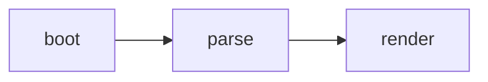
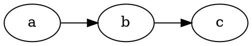

# Markdown rendering

How a notebook note becomes the rendered page. Everything in this document
describes the client-side pipeline; the server stores note bodies as plain
text and never renders Markdown itself.

## Overview

The viewer renders with marked v12 in GFM mode and `breaks` off
(`static/js/viewer.js:260`):

```js
marked.parse(src, { gfm: true, breaks: false });
```

After marked returns HTML it is assigned to `#viewer-content.innerHTML`, then
the post-processing runs in order (`static/js/viewer.js:267`):

1. Every `h1`–`h6` gets a stable, deduplicated `id` (`static/js/viewer.js:268`,
   slugify at `static/js/viewer.js:45`). The outline tracks those ids, and
   `?file=…&heading=…` deep links scroll to them (`static/js/app.js:550`,
   `static/js/viewer.js:792`).
2. highlight.js highlights every `pre code` (`static/js/viewer.js:278`).
3. `NB.blocks.renderAll()` runs the five special block renderers
   (`static/js/viewer.js:291`, registry at `static/js/blocks.js:192`).

Markdown is rendered **un-sanitized**. The notes are the user's own files, so
there is no third-party content in the render path (`static/js/viewer.js:5`).
If untrusted content is ever introduced, a vendored DOMPurify pass is required
before `innerHTML`.

Because `breaks` is off, a single newline does not start a new paragraph.
There is no emoji shortcode plugin, so `:smile:` stays literal text.

## Supported syntax

marked's GFM mode covers standard Markdown plus:

- Tables (with the preview-only table view described in
  `static/js/table-view.js`).
- Task lists (`- [ ]` / `- [x]`); Turndown emits them back as task items.
- Fenced and indented code blocks.
- Autolinks and raw HTML.
- Strikethrough.

Atx headings (`#` through `######`) become the outline and get anchor ids.
Setext headings (`===` / `---` underlines) also render, but the outline is
built from `<h1>`–`<h6>` elements, so they are anchored the same way.

## Special fenced blocks

Five fence languages render specially rather than as highlighted source. Each
is a fixed vendored version, so only syntax that version supports works. The
renderers are modules that register a descriptor with `NB.blocks`
(`static/js/blocks.js:63`). Registration order is render order.

### `mermaid` — Mermaid 11.16

Flowcharts, sequence diagrams, class diagrams, state diagrams, ER diagrams,
gantt charts, and the other Mermaid diagram types.

````markdown

````

Mermaid is initialized with `securityLevel: "strict"` and `startOnLoad: false`
(`static/js/mermaid.js:110`). Strict mode disables interactive click and link
directives, so a click on a diagram node cannot navigate. Click a rendered SVG
to open the full-size lightbox (`static/js/mermaid.js:289`). A syntax error
replaces the block with an in-place `.mermaid-error` box and raises a toast
(`static/js/mermaid.js:193`). Rendering is asynchronous; the original fence
stays in the note, and the rendered container keeps the source in a dataset
for the hybrid round-trip (`static/js/mermaid.js:148`). The 3.5 MB bundle is
fetched on demand only when a note contains a mermaid block
(`static/js/mermaid.js:243`).

### `wavedrom` — WaveDrom 3.3

Digital timing and waveform diagrams. The body is WaveDrom JSON.

````markdown
```wavedrom
{signal: [
  {name: 'clk', wave: 'p.....'},
  {name: 'dat', wave: 'x.345x', data: ['head', 'body', 'tail']}
]}
```
````

The parser tries strict `JSON.parse` first and falls back to a lenient `eval`
so unquoted (JS-style) keys are accepted, matching the official WaveDrom
editor (`static/js/wavedrom.js:240`). Malformed blocks fall back to an inline
`.wavedrom-error` box plus a toast (`static/js/wavedrom.js:187`). Click a
rendered waveform to open the lightbox (`static/js/wavedrom.js:265`).

### `math` / `katex` — KaTeX 0.16

Display-mode LaTeX. `math` and `katex` are aliases; the hybrid round-trip
always writes the fence back as `math` (`static/js/katex.js:144`).

````markdown
```math
\int_0^\infty e^{-x^2}\,dx = \frac{\sqrt{\pi}}{2}
```
````

Only KaTeX-supported LaTeX commands work. There are no full TeX macros.
`displayMode: true` and `throwOnError: false` (`static/js/katex.js:87`); a bad
expression renders the raw source in place rather than throwing.

### `dot` / `graphviz` — Graphviz 2.40.1

Graphviz diagrams, rendered by Viz.js 2.1.2 compiled to WASM. The two vendor
bundles are `viz.js` and `viz.full.js`. Both fences are aliases; the
round-trip writes `dot` (`static/js/viz.js:203`).

````markdown

````

This is an old Graphviz. Avoid syntax newer than 2.40. The ~2 MB WASM bundles
load on demand (`static/js/viz.js:33`). Click a rendered graph to open the
lightbox.

### `html-live`

A sandboxed iframe that runs the markup. Plain `html` (without `-live`) still
shows highlighted source (`static/js/htmlpreview.js:5`).

````markdown
```html-live
<!-- height: 480 -->
<button onclick="this.textContent='clicked'">Click me</button>
```
````

An optional comment line `<!-- height: 480 -->` sets a minimum height
(`static/js/htmlpreview.js:54`). The parser scans the whole block, so the hint
may sit anywhere. The frame still grows to fit taller content; the hint is a
floor, not a fixed size. It accepts `height: N` or `height=N`, optionally
prefixed by `//`, `<!--`, or `#`.

## `html-live` sandbox

The iframe is built with `sandbox="allow-scripts"` and deliberately **without**
`allow-same-origin` (`static/js/htmlpreview.js:207`). Scripts run, but the
document gets an opaque origin. The following are blocked:

- Cookies.
- `localStorage` and `sessionStorage` (an opaque origin throws).
- The parent page's DOM.
- The notebook API (`/api/*`).
- Same-origin `fetch`.
- Form submission.
- `window.open` and popups.
- File downloads.
- `alert`, `confirm`, and `prompt`.
- Top-level navigation.

External `fetch` is subject to CORS. Use `html-live` only for self-contained,
offline demos. This list must stay in sync with the assistant's system prompt
(`static/js/ai.js:768`) and the `/agent.md` guide (`agent.md:154`); tests
assert the restrictions appear in both (`tests/test_app.py:2211`).

## Wikilinks

Obsidian-style `[[Target]]` links are tokenized by a marked inline extension
registered once at module load (`static/js/viewer.js:75`). Resolution rules
(`static/js/viewer.js:114`):

- A bare stem resolves by basename. `[[README]]` and `[[README.md]]` both link
  to `README.md`, even from a subfolder.
- A path is relative to the current note's folder. `.` and `..` segments are
  normalized.
- `[[Target#anchor]]` deep-links to the heading with that slug.
- `[[Target|label]]` sets the link text.

An unresolvable target renders as plain text, never a dead link
(`static/js/viewer.js:98`). Clicking a resolved wikilink opens the target in
place through the SPA; there is no page reload, and the back button restores
the source note and scroll position (`static/js/viewer.js:980`,
`static/js/app.js:575`).

## Hybrid editing and the write-back contract

Hybrid (WYSIWYG) mode edits the rendered DOM in place. On save it converts the
DOM back to Markdown with Turndown plus the GFM plugin
(`static/js/hybrid.js:72`). A wikilink added to the DOM round-trips through a
custom Turndown rule so it is written back as `[[Target]]`
(`static/js/hybrid.js:87`).

Turndown strips unknown markup to text. That would destroy rendered diagrams,
so `NB.blocks.restoreForMarkdown()` runs first on a cloned DOM. It replaces
every rendered container and error box with a fenced block holding the
original source, using each descriptor's `fence` language
(`static/js/blocks.js:144`). This is the data-loss-critical step: it is why a
new renderer must register with `NB.blocks` and expose its source, either as a
dataset key on the container or as a `.sourceClass` child inside the error
box.

The registry also owns the hybrid click-to-edit type table
(`static/js/blocks.js:182`), so a registered renderer is automatically
click-to-editable and round-trippable.

## Adding or changing a renderer

A renderer module registers a descriptor with `NB.blocks.register()` at load
(`static/js/blocks.js:63`). The descriptor names the module, the claimed fence
languages, the round-trip fence, the selector, the container class, and the
dataset key or source class.

Adding or changing a renderer touches four places that a test keeps in sync:

1. The module file itself, loaded by `templates/index.html`.
2. `static/sw.js` `PRECACHE`, so the service worker caches it.
3. The assistant's system prompt in `static/js/ai.js` (`static/js/ai.js:768`).
4. The `/agent.md` guide (`agent.md:148`).

The registry-completeness guard in `tests/dom/test_dom.js:3116` asserts every
registered module appears in all four. `tests/test_app.py:2211` asserts the
fence languages, the fixed versions, and the `html-live` restrictions appear on
`/agent.md`. Whenever a fence name, a vendored version, or a sandbox
restriction changes, update `ai.js` and `agent.md` in the same change or the
suite fails.
