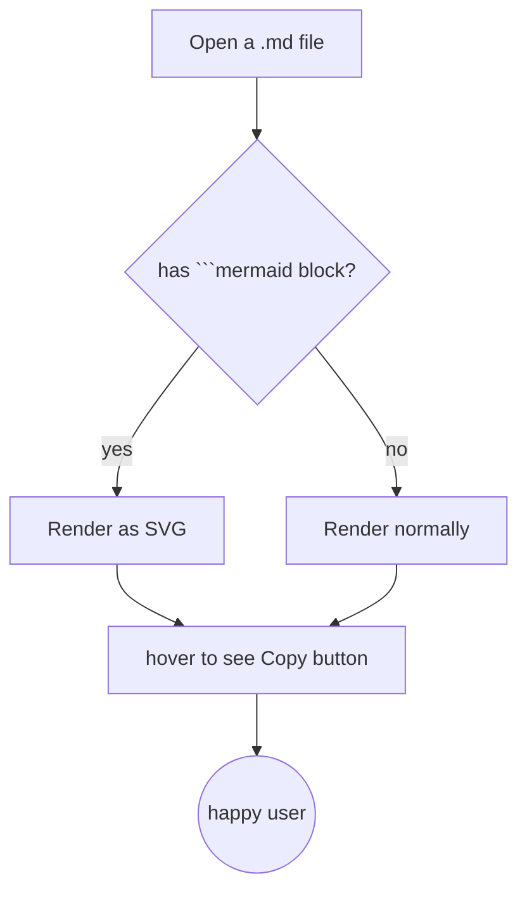
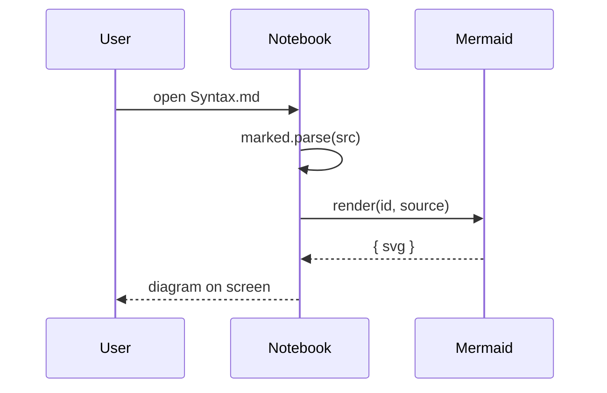
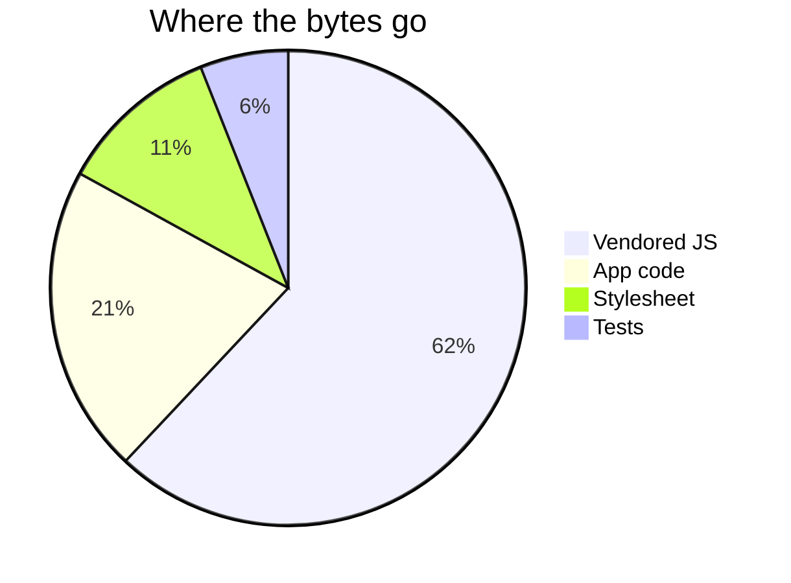

# Syntax

A live demo of every feature the notebook supports. Open this file in
the app and you'll see each section render the way it's meant to —
code blocks with one-click **Copy** buttons, Mermaid diagrams, syntax
highlighting, the heading outline, the search field, the sidebar's
**Bookmarks** section, and so on. The "how to use" notes under each
section tell you where to click to exercise the feature.

---

## Markdown basics

Headings (`# H1`, `## H2`, …) appear in the right-side **Outline**;
click any heading to jump to it. Headings are also scroll-spy targets
(the outline item highlights as you scroll past the corresponding
section).

> Use a `> blockquote` for callouts. This is just regular Markdown
> but it gets a different look in our theme so it stands out from
> the surrounding prose.

Ordered and unordered lists work, as do nested ones. Tables are
supported too:

| Feature             | Where to look                 |
|---------------------|-------------------------------|
| Heading outline     | Right panel                   |
| File tree           | Left panel                    |
| Bookmarks           | Left panel, above the tree    |
| Search              | Press `/` from anywhere       |
| Settings            | ⚙ button, top bar             |

Inline code like `marked.parse(src)` and **bold**, *italic*, and
~~strikethrough~~ are all standard GFM. Links: [README](README.md).

Horizontal rule (the line above this section):

---

## Code blocks with syntax highlighting + Copy button

Every code block in this notebook (except inside Mermaid sections) has
a small **Copy** button that appears when you hover the top-right
corner. One click copies the raw source — not the post-highlight
markup — to your clipboard. A short "Copied!" toast confirms the
action.

### Python

```python
def fib(n):
    if n < 2:
        return n
    return fib(n - 1) + fib(n - 2)

# Quick check
for i in range(8):
    print(i, fib(i))
```

### JavaScript

```javascript
// Mermaid is exposed on window.mermaid once the vendored bundle
// has loaded (defer). The integration waits for it before rendering.
async function renderMermaidBlocks(container) {
  const blocks = container.querySelectorAll('pre > code.language-mermaid');
  for (const code of blocks) {
    await window.mermaid.render(idCounter++, code.textContent);
  }
}
```

### Shell

```bash
./start.sh                       # 0.0.0.0:5000, debug off
./start.sh --host 127.0.0.1      # bind loopback only
./start.sh --port 8080 --debug
```

### Diff

```diff
- ## old heading
+ ## new heading
  unchanged line
- removed
+ added
```

> **Tip:** the **Copy** button copies the *source* above — paste it
> into a fresh code block and it round-trips byte-for-byte, no
> `<span class="hljs-…">` soup.

---

## Mermaid diagrams

Diagrams render as inline SVG. They follow the body theme — flip the
theme (⚙ → Appearance) and the next render re-initializes Mermaid so
diagrams use the new palette.

### Flowchart



### Sequence



### Pie



### Broken diagram → error fallback

This block is intentionally invalid Mermaid. The notebook replaces it
with a red-bordered "Mermaid error:" header plus the source in a
styled `<pre>`, so you can see the error and copy the source back
into the editor to fix it.

```mermaid
this is not valid mermaid syntax at all
```

---

## File tree + context menu (left panel)

**How to use:**
- **Click** a file to open it in a new tab.
- **Right-click** a file or folder for the context menu: Open, New
  file here, New folder here, Rename / Move, Copy, Delete.
- **Right-click the empty area** below the tree to create a file or
  folder at the root.
- **Drag a file** into a folder to move it.

The tree is also collapsible: click the `▾` next to a folder to fold
its children.

---

## Bookmarks (left panel, above the tree)

The **Bookmarks** section sits above the file tree. Pin any markdown
file you want quick access to.

**How to use:**
- **Right-click** any file in the tree → **Add bookmark** (or
  **Remove bookmark** to unpin).
- **Hover** a tree row and click the small ★ on the right side.
- Click the **★ +** in the Bookmarks header to bookmark the
  currently-open file.
- **Drag a bookmark** to reorder it within the list.
- **Right-click a bookmark row** for Open / Rename / Move / Copy /
  Delete / Remove bookmark.

Bookmarks persist in `config/config.json` (`bookmarks: [...]`) and
survive a reload. If you delete a bookmarked file, the entry is
silently pruned on the next tree refresh.

---

## Multi-tab editor

Every opened file lives in its own tab along the top. The currently
active tab is highlighted.

**How to use:**
- **Click** a tab to switch to it.
- **Click the ×** to close (asks for confirmation if you have
  unsaved changes).
- **Click and drag** a tab to reorder.
- **Right-click** a tab for Pin / Unpin / Close / Close others /
  Close all.
- **Ctrl/Cmd + click** a tab to pin it (pinned tabs don't close when
  you "close others").

The editor (CodeMirror 6) sits behind the viewer; click **Edit** in
the top bar (or press **Ctrl/Cmd + E**) to switch into edit mode.
Edits are debounced ~150ms and the right pane previews them live.

---

## In-page search

Press **`/`** from anywhere to open the search panel at the top.
Search runs across all `.md` files in the notebook.

**How to use:**
- Type a query; matches stream in as you type, with the file name
  and a one-line snippet (the match wrapped in `<<…>>` on the
  server, re-rendered as `<mark>` on the client).
- `j` / `k` or arrow keys to move between hits.
- `Enter` on a hit to jump to that file and line; the file opens in
  a new tab if it isn't already open.
- `Esc` to close.

---

## VIM mode (optional)

Settings (⚙) → **Keyboard** → **VIM mode** turns on vim-style
keybindings across the whole app:

- The **sidebar**, **editor**, and **outline** act as three vim
  "windows" — `Ctrl+W` to cycle, `H`/`J`/`K`/`L` to jump to one.
- Inside the editor, full VIM (normal/insert, motions, text
  objects, `:w` to save, `:q` to exit, `:wq` to save and exit).
- Press `?` from the shell (sidebar or outline) for the full keymap.

You can also paste a custom **VIM initial script** (vimrc) in the
same Settings pane — see the file `VIMRC.md` (if present) for the
supported subset of vimscript. The example below is a stub that
remaps `H` to "go to start of line" and `L` to "go to end of line"
in normal mode:

```vim
" VIM initial script (Settings -> Keyboard -> VIM initial script)
nmap H 0
nmap L $
imap jj <Esc>
```

If you save that in the Settings pane, your `H` / `L` keys in normal
mode jump to start / end of line, and `jj` in insert mode exits to
normal mode.

---

## Theme + font size + wallpaper

Settings (⚙) → **Appearance**:

- **Theme**: Auto / Dark / Light. The body and the code-block
  highlight theme follow.
- **Font size**: Small / Medium / Large / X-Large. Scales the
  whole app.
- **Wallpaper**: Off / Dots / Grid / Lines / Bricks. Each wallpaper
  has its own color and intensity slider. Choose Scroll (the
  wallpaper moves with the content) or Fixed (it stays put).

---

## Deep links

The URL is the state. You can bookmark or share a link that opens
the app at a specific file and heading:

```
http://127.0.0.1:5000/?file=Syntax.md&heading=Code-blocks
```

`file=` opens that file; `heading=` scrolls to the heading whose
slug matches. The browser **Back** button steps through your
navigation history inside the app (file opens, heading jumps).

---

## Settings modal

Click **⚙** in the top bar to open the modal. Tabs on the left:

- **General**: file-watching status (live / polling / off), VIM
  mode toggle, VIM initial script.
- **Appearance**: theme, font size, wallpaper + color + intensity +
  scroll.
- **Shortcuts**: every configurable app action with its current
  binding. Click a binding to capture a new one; **Reset all to
  defaults** at the bottom.
- **Security** (only when auth is enabled): change the admin /
  viewer passwords.
- **About**: data directory + config directory paths.

The modal remembers its own width + height (Settings → "Settings
modal width / height") so you can size it to your monitor.

---

## Optional: password gate

Not on by default. Enable it from the same **Security** tab once
you've set an admin password. After that:

- **Admin password** (required to enable auth): writes are gated
  (saving, editing, deleting, creating, renaming, moving, copying).
- **Viewer password** (optional): reads are also gated.

Wrong-password rate-limiter trips 429 after 5 failed attempts in 60s
per client IP. The **Logout** button (top bar) ends the current
session; sign in again to keep working.

---

## What's NOT supported yet

A few things you might expect from a heavier Markdown editor that
this app deliberately does not do:

- **Mermaid `:click` callbacks** — diagrams are static SVGs. The
  lib's `securityLevel: "strict"` disables click events for safety.
- **Real-time multi-user editing** — single-user by design. Open
  the same file in two tabs and the second tab's edits will
  overwrite the first on save.
- **A general-purpose vimscript engine** — only the small mapping
  subset listed in the VIM initial script pane. `:command Foo`
  definitions aren't supported (the browser has nowhere to dispatch
  the command to).
- **PDF / image paste** — image embeds via `` work if the
  path resolves to a file the server can serve; pasting from the
  clipboard does not auto-upload.

That's the whole surface. If something here doesn't work the way
this file says it does, that's a bug — open an issue.
